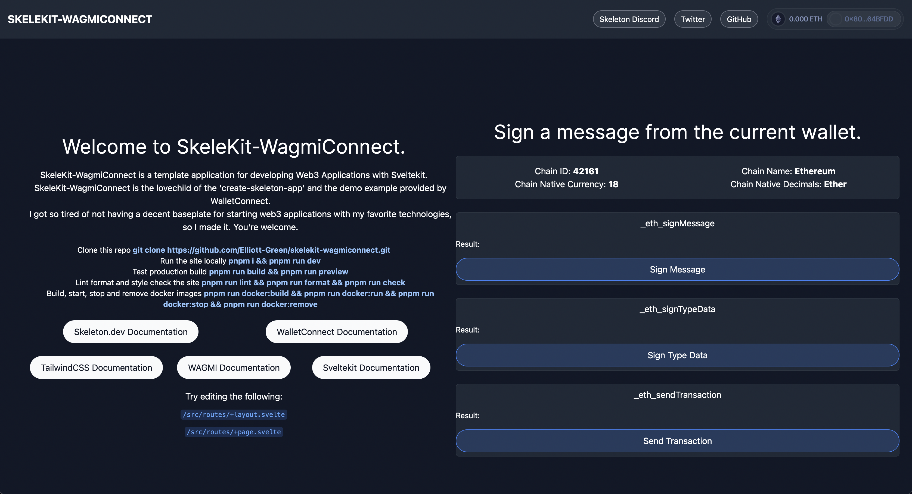
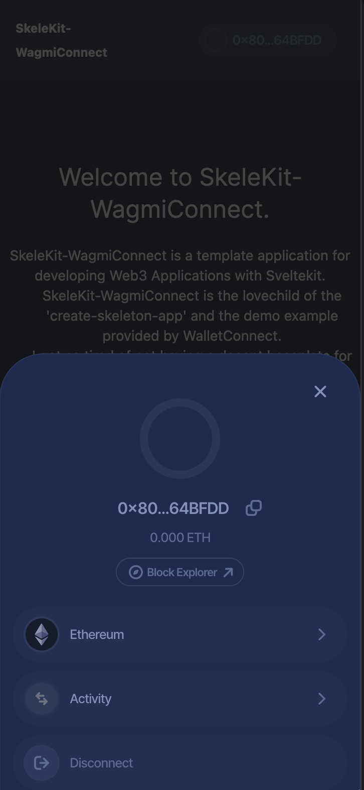
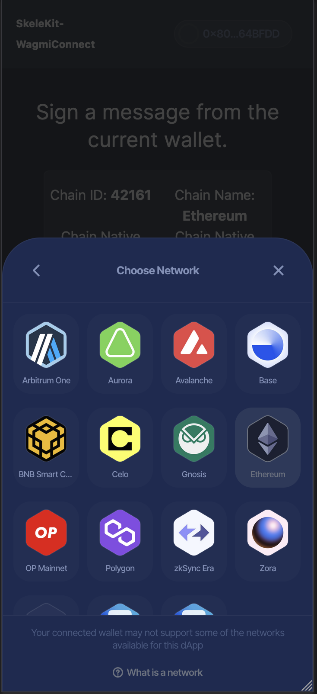
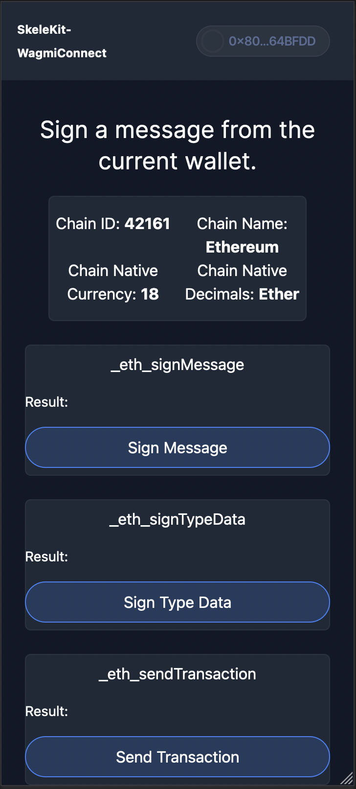

<!-- Improved compatibility of back to top link -->

<a name="readme-top"></a>

[![Contributors][contributors-shield]][contributors-url]
[![Forks][forks-shield]][forks-url]
[![Stargazers][stars-shield]][stars-url]
[![Issues][issues-shield]][issues-url]
[![MIT License][license-shield]][license-url]

# Skelekit-WagmiConnect

A more opinionated, but barebones front end web3 template using some of my favorite technologies.

SkeleKit-WagmiConnect is the lovechild of the 'create-skeleton-app' and the demo example provided by WalletConnect.

This repository superceeds my previous frontend learning efforts with Sveltekit [here](https://github.com/Elliott-Green/SveltekitXSkeletonXEthers)

<p align="center">
   
   
   
   
</p>

## Virgins of the way

First time using Sveltekit? Check the [SvelteKit docs here](https://kit.svelte.dev/docs/). It's the only frontend framework which doesn't make me want to cry, maybe you'll like it too.

First time using Skeleton/Tailwind? Check the [Tailwind CSS docs here](https://tailwindcss.com/) and the [Skeleton docs here](https://www.skeleton.dev/). Hate writing CSS? Me too! Stop, learn Tailwind. There's lots of component support available online. Skeleton is a pretty nice UI framework for Sveltekit and Tailwind, they've got you covered with theme support and prebuild components.

First time using WalletConnect? Check the [WalletConnect docs here](https://docs.walletconnect.com/web3modal/javascript/actions). Support multiple different wallet types across multiple different networks with mobile support out of the box.

First time using Wagmi? Check out the [Wagmi docs here](https://wagmi.sh/core/api/actions). You get your icecream in two main flavours here, WalletConnect comes with the wagmi flavour, so we inherit using it over 'ethers' because it's easier - feel free to make a fork with this enhancement!

## Commands

### Developing

```bash
## clone
mkdir skelekit-wagmiconnect
cd skelekit-wagmiconnect
git clone https://github.com/Elliott-Green/skelekit-wagmiconnect.git

## install dependancies
pnpm install

## start dev server
pnpm run dev
```

### Pre commit test build

```bash
## build for production
pnpm run preview
## run production build
pnpm run build
```

### Pre commit lint

```bash
## run html/css/js/ts check
pnpm run check
## run prettier lint check
pnpm run lint
## run prettier lint format
pnpm run format
```

### Docker bros

```bash
## Docker builds image
pnpm run docker:build
## Docker runs image as container
pnpm run docker:run
## Docker stops container
pnpm run docker:stop
## Docker removes the container
pnpm run docker:remove
## Docker removes the image and cache
pnpm run docker:clean
```

## Vercel .envs

Using vercel you can specifiy if envs are inserted into the UI or through a .env.

`VITE_PROJECT_ID` should be set to a [wallet-connect dapp ID](https://cloud.walletconnect.com/) to become available through its 'dapp explorer', else just set it to 1.

## Micro Audit

Users should be aware that using WalletConnect does actually call into their servers which records your users IP address, developers should be aware of this point.

```bash
pnpm audit
No known vulnerabilities found
```

## Licence

Distributed under the MIT License. See LICENSE.txt for more information.

## Contact

Elliott Green - [@cryptonines](https://twitter.com/cryptonines)

Project Link: [https://github.com/Elliott-Green/skelekit-wagmiconnect](https://github.com/Elliott-Green/skelekit-wagmiconnect)

<p align="right">(<a href="#readme-top">back to top</a>)</p>

[contributors-shield]: https://img.shields.io/github/contributors/Elliott-Green/skelekit-wagmiconnect.svg?style=for-the-badge
[contributors-url]: https://github.com/Elliott-Green/skelekit-wagmiconnect/graphs/contributors
[forks-shield]: https://img.shields.io/github/forks/Elliott-Green/skelekit-wagmiconnect.svg?style=for-the-badge
[forks-url]: https://github.com/Elliott-Green/skelekit-wagmiconnect/network/members
[stars-shield]: https://img.shields.io/github/stars/Elliott-Green/skelekit-wagmiconnect.svg?style=for-the-badge
[stars-url]: https://github.com/Elliott-Green/skelekit-wagmiconnect/stargazers
[issues-shield]: https://img.shields.io/github/issues/Elliott-Green/skelekit-wagmiconnect.svg?style=for-the-badge
[issues-url]: https://github.com/Elliott-Green/skelekit-wagmiconnect/issues
[license-shield]: https://img.shields.io/github/license/Elliott-Green/skelekit-wagmiconnect.svg?style=for-the-badge
[license-url]: https://github.com/Elliott-Green/skelekit-wagmiconnect/blob/main/LICENCE
